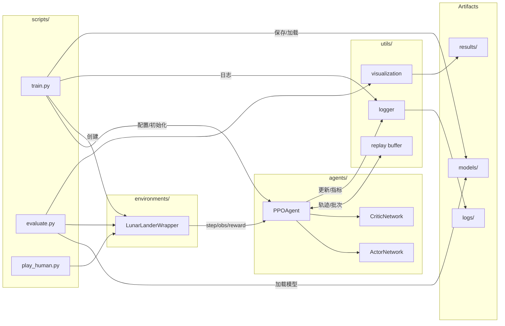
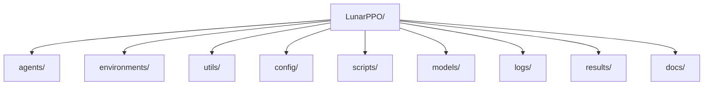

# 架构图（图片）

本页提供项目架构的可视化图示，用于教学展示与实现参考。使用 Mermaid 绘制数据流与模块边界，便于在 Markdown 中直接渲染。

## 系统数据流图

## 目录关系图

## 使用说明
- 若渲染环境不支持 Mermaid，可将上述图导出为 SVG/PNG 放置在 `docs/images/` 并在页面中引用
- 教学展示时可配合模块职责与数据流讲解，帮助学生建立整体认知 
